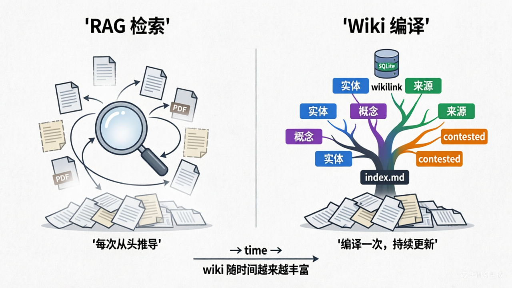
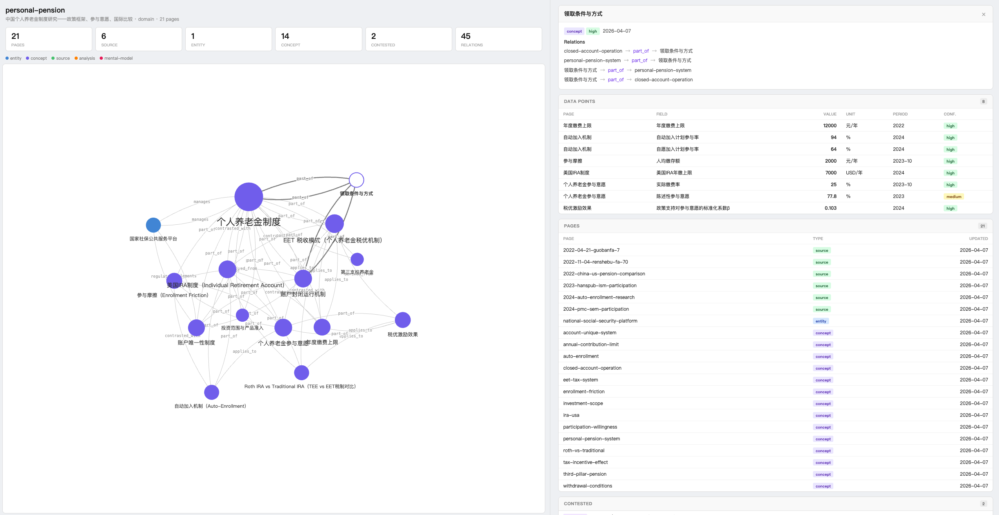
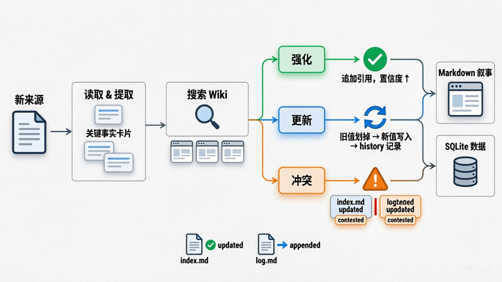
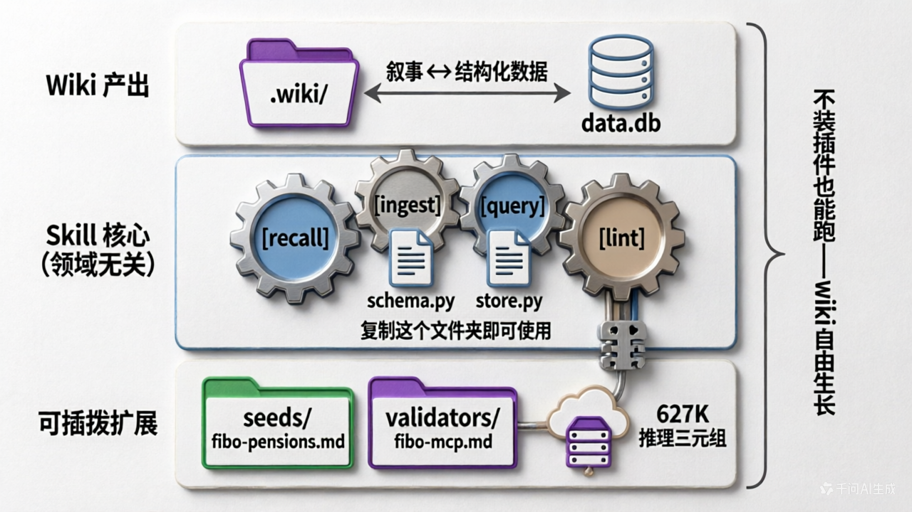
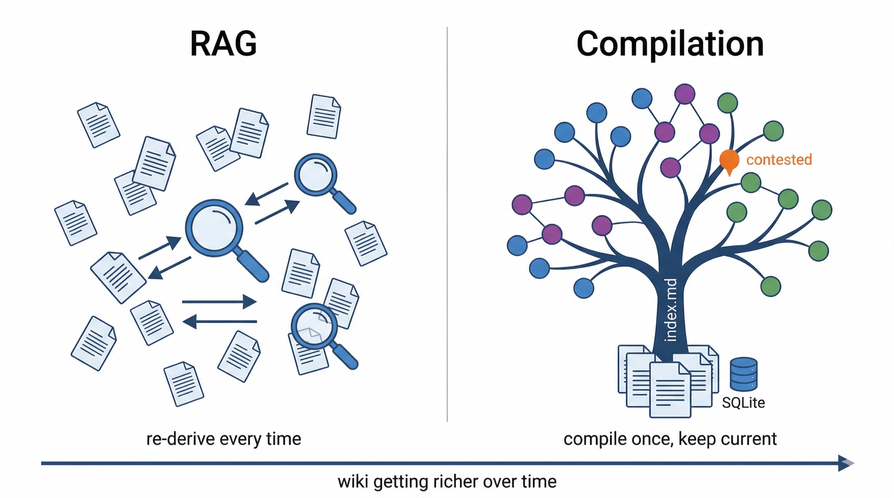
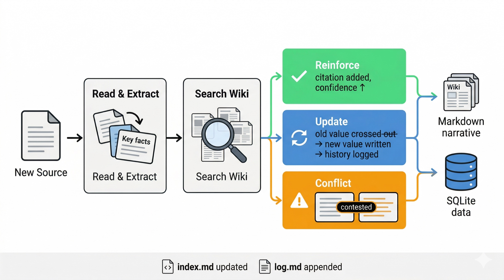
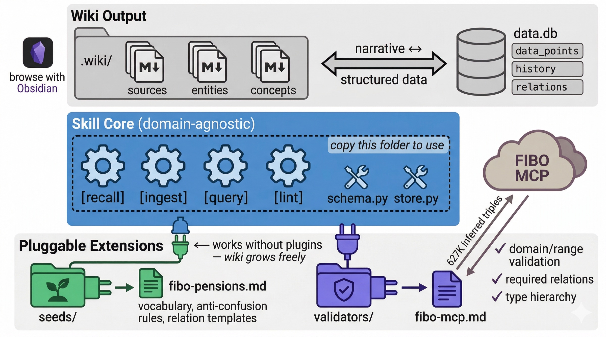

# auto-wiki

> ### Quick Install
>
> **Claude Code** — paste this in your terminal:
> ```
> Learn the auto-wiki skill from https://github.com/hanlinlibham/auto-wiki — read skill/auto-wiki-en/SKILL.md and its references/ directory. Use it to build persistent knowledge wikis with ingest/recall/query/lint/deep-dive.
> ```
>
> **OpenClaw / Other Agents** — add to your system prompt:
> ```
> You have access to the auto-wiki knowledge compiler skill. Read the SKILL.md file at https://github.com/hanlinlibham/auto-wiki/tree/main/skill/auto-wiki-en to learn how to build and maintain persistent wikis with five modes: recall, ingest, query, lint, deep-dive.
> ```

<details>
<summary><b>🇨🇳 点击切换中文版</b></summary>

---

> ### 快速安装
>
> **Claude Code** — 粘贴到终端：
> ```
> 学习 auto-wiki skill，地址 https://github.com/hanlinlibham/auto-wiki ——读取 skill/auto-wiki-cn/SKILL.md 及其 references/ 目录。用它来构建持久化知识 wiki，支持 ingest/recall/query/lint/deep-dive 五个模式。
> ```
>
> **OpenClaw / 其他 Agent** — 加到系统提示词：
> ```
> 你可以使用 auto-wiki 知识编译器 skill。读取 https://github.com/hanlinlibham/auto-wiki/tree/main/skill/auto-wiki-cn 中的 SKILL.md 学习如何构建和维护持久化 wiki，支持 recall、ingest、query、lint、deep-dive 五个模式。
> ```

教你的 AI Agent 构建和维护持久化知识 wiki——让它不再做完就忘。



### 问题

AI Agent 做研究、写报告、拉数据——然后全忘了。下周问同样领域的问题，又从零开始。RAG 能检索，但不能积累——每次都从原始文档重新推导答案。

### 方案

auto-wiki 是一个给 AI Agent（Claude Code、Codex 等）用的 Skill。装上之后，Agent 会自己维护一个 wiki：读到新材料就和已有页面比对，该更新的更新，说法矛盾的标出来，数据变了的记下演化过程。

五个模式：

| 模式 | 触发 | Agent 做什么 |
|------|------|-------------|
| **recall** | `/auto-wiki recall {topic}` | 加载 wiki 上下文，后续所有问题先查 wiki 再回答 |
| **ingest** | `/auto-wiki ingest` 或提供源材料 | 读源文件 → 比较新旧 → 更新/创建页面 → 数据写入 SQLite |
| **query** | `/auto-wiki query` | 单次查询：搜索 wiki → 综合回答并引用来源 → 识别缺口 |
| **lint** | `/auto-wiki lint` | 扫描全部页面 → 修复断链 → 检测矛盾 → 报告健康度 |
| **deep-dive** | `/auto-wiki deep-dive` 或"上强度" | 自动扫描知识缺口 → 用户确认 → 搜索补全 → 编译进 wiki |

Agent 也能从自然语言自动路由——"之前研究过 XX"触发 recall，丢给它一篇文件触发 ingest，说"上强度"触发 deep-dive。

### 快速开始

1. 复制 `skill/auto-wiki-cn/`（中文版）或 `skill/auto-wiki-en/`（英文版）到你的 Agent 工作区
2. 让 Agent 读取 `SKILL.md` 作为指令
3. 先积累，再使用：

**积累：**
```
你：   /auto-wiki ingest
你：   "研究个人养老金制度，帮我建立知识框架"
Agent: [搜索政策文件 → 创建 wiki → ingest 2 个来源 → 构建 6 个概念页面]

你：   "找一些关于参与意愿的研究"
Agent: [搜索 → 找到 3 篇论文 → ingest → 更新已有概念 → 标记 1 处矛盾]
```

**调用：**
```
你：   /auto-wiki recall personal-pension
Agent: 已进入 recall 模式。当前 wiki：22 页 / 8 数据点 / 2 处 contested。

你：   "政策应该怎么设计来提高参与率？"
Agent: 根据 [[enrollment-friction]]、[[tax-incentive-effect]] 和 [[ira-usa]]...
       ⚠️ 注意：税优激励效果存在矛盾（77.8% vs 25%）
       缺口：尚无 35 岁以下群体行为研究，建议补充。
```

### 可视化报告



*`schema.py --report` 生成的交互式报告：关系图 + 数据表 + 页面列表 + contested 标注*

### Ingest 怎么工作



Agent 拿到新材料后，会逐页和 wiki 里已有的内容比对，然后做出判断：

| 结果 | 触发条件 | 动作 |
|------|---------|------|
| **强化** | 新信息与已有结论一致 | 追加来源引用，提升 confidence |
| **更新** | 新信息有更新的日期或更权威的来源 | 改写页面，旧结论进 history |
| **冲突** | 来源意见不一致，无法判断谁对 | 并列保留，标记 `contested` |

### 垂直领域适配



Skill 核心是领域无关的编译引擎。垂直领域的专业性通过可插拔的种子和校验器注入：

- **无种子**：wiki 自由生长，适合探索性研究
- **有种子**（`seeds/`）：Agent 从行业标准术语起步，遵守禁混规则，概念命名规范
- **有校验器**（`validators/`）：lint 检查逻辑完整性——不是纠错别字，是纠"PensionFund 缺少 Trustee 关系"

种子是社区可贡献的插件——为你的垂直领域写一个 markdown 文件，声明核心术语和禁混规则即可。

### 致谢

- **[LLM Wiki](https://github.com/swyxio/ai-notes/blob/main/Resources/llmwiki.md)** — 想法由 [Tobi Lutke](https://x.com/tobi/status/1935967165527437666) 提出，[swyx](https://github.com/swyxio) 整理为实现文档
- **[autoresearch](https://github.com/karpathy/autoresearch)** by Andrej Karpathy
- **[FIBO](https://spec.edmcouncil.org/fibo/)** by EDM Council · **[fibo-mcp](https://github.com/NeurofusionAI/fibo-mcp)** by NeurofusionAI
- **[Nuwa Skill](https://github.com/alchaincyf/nuwa-skill)** by 花叔 · **[Obsidian](https://obsidian.md/)**

MIT. 见 [LICENSE](LICENSE)。

---

</details>

Teach your AI agent to build and maintain a persistent knowledge wiki — so it stops forgetting what it learned yesterday.



## The Problem

AI agents do research, write reports, pull data — then forget everything. Ask the same domain question next week, and the agent starts from scratch. RAG helps with retrieval, but it doesn't *accumulate* — it re-derives answers from raw documents every time.

## The Solution

auto-wiki is a **knowledge compiler** skill for AI agents (Claude Code, Codex, etc.). Instead of retrieving from raw documents at query time, the agent incrementally builds and maintains a structured wiki — comparing new information against existing pages, updating what changed, flagging contradictions, and preserving the evolution of knowledge.

Five modes:

| Mode | Trigger | What the Agent Does |
|------|---------|-------------------|
| **recall** | `/auto-wiki recall {topic}` | Load wiki context, answer all subsequent questions from accumulated knowledge |
| **ingest** | `/auto-wiki ingest` or provide source material | Read source → compare old vs new → update/create pages → write data to SQLite |
| **query** | `/auto-wiki query` | One-shot: search wiki → synthesize answer with citations → identify gaps |
| **lint** | `/auto-wiki lint` | Scan all pages → fix broken links → detect contradictions → report health |
| **deep-dive** | `/auto-wiki deep-dive` or "level up" | Auto-scan knowledge gaps → user confirms → search to fill → compile into wiki |

The agent also auto-routes from natural language — "what did we learn about X" triggers recall, handing it a file triggers ingest, saying "level up" triggers deep-dive.

## Quick Start

1. Copy `skill/auto-wiki-en/` (English) or `skill/auto-wiki-cn/` (Chinese) into your agent's workspace
2. Point your agent to `SKILL.md` as its instruction file
3. Build knowledge, then use it:

**Accumulate:**
```
You:   /auto-wiki ingest
You:   "Research personal pension policy, build me a knowledge framework"
Agent: [searches policy docs → creates wiki → ingests 2 sources → builds 6 concept pages]

You:   "Now find academic research on participation willingness"
Agent: [searches → finds 3 papers → ingests → updates existing concepts → flags 1 contradiction]
```

**Recall:**
```
You:   /auto-wiki recall personal-pension
Agent: Recall mode active. Wiki: 22 pages / 8 data points / 2 contested.

You:   "How should policy be designed to increase participation?"
Agent: Based on [[enrollment-friction]], [[tax-incentive-effect]], and [[ira-usa]]...
       ⚠️ Note: tax incentive effectiveness is contested (77.8% vs 25%)
       Gap: no research on under-35 demographics yet — suggest ingesting more.
```

## Architecture

```
.wiki/{topic}/
├── data.db              ← Structured data (SQLite: data points, history, relations)
├── meta.yaml            ← Wiki metadata
├── index.md             ← Navigation (Agent-maintained)
├── log.md               ← Operation log (append-only)
├── sources/             ← Source summaries (immutable)
├── entities/            ← Entity pages (narrative analysis)
├── concepts/            ← Concept pages
└── analyses/            ← Archived query outputs
```

**Two layers, clean separation:**

- **Markdown pages** — narrative analysis, wikilinks, human-readable. Compatible with [Obsidian](https://obsidian.md/).
- **SQLite database** — numeric data, time series, relations, history. Queryable.

## How Ingest Works



When the agent gets a new source, it compares against every relevant wiki page and decides:

| Result | When | Action |
|--------|------|--------|
| **Reinforce** | New info matches existing conclusion | Add source citation, raise confidence |
| **Update** | New info has newer date or better source | Rewrite page, move old conclusion to history |
| **Conflict** | Sources disagree, can't determine which is right | Keep both, mark as `contested` |

This comparison loop is what keeps the wiki useful as it grows.

## How Recall Works

Recall is a persistent mode for the conversation. Once entered, every question consults the wiki first:

1. Agent loads `index.md` + `data.db` summary on entry
2. For each question: extract keywords → match pages in index → query data.db → read relevant pages
3. Answer with citations (`[[page-slug]]`), flag contested info, report knowledge gaps
4. Never fabricate — if the wiki doesn't have it, say so and suggest what to ingest

Exit with `exit recall` or by switching to another mode.

## Vertical Domain Adaptation



The skill core is a domain-agnostic compilation engine. Vertical domain expertise is injected through pluggable seeds and validators:

- **Without a seed**: wiki grows freely, suitable for exploratory research
- **With a seed** (`seeds/`): agent starts from industry standard terms, follows anti-confusion rules, normalized naming
- **With a validator** (`validators/`): lint checks logical completeness — not typos, but "PensionFund is missing a Trustee relation"

Seeds are community-contributable plugins — write a markdown file for your vertical domain declaring core terms and anti-confusion rules.

## Visualization


*Interactive report generated by `schema.py --report`: relation graph + data points + pages + contested markers*

```bash
python references/schema.py --report .wiki/my-topic/
# → generates .wiki/my-topic/_report.html
# → open in browser
```

Also works with Obsidian — open `.wiki/` as a vault, graph view renders the wikilink topology automatically.

## Tools

| Tool | Purpose | Usage |
|------|---------|-------|
| `schema.py` | Validate page frontmatter | `python schema.py .wiki/topic/` |
| `schema.py --report` | Generate visual HTML report | `python schema.py --report .wiki/topic/` |
| `store.py init` | Initialize data.db | `python store.py init .wiki/topic/` |
| `store.py dump` | Print database summary | `python store.py dump .wiki/topic/` |

## Requirements

- Python 3.10+ (standard library `sqlite3` — no external DB needed)
- `pyyaml` and `pydantic` for schema validation (`pip install -r requirements.txt`)
- An AI agent that can read/write files (Claude Code, Codex, etc.)
- Optional: WebSearch capability for autonomous research mode

## Acknowledgements

This project builds on ideas and inspiration from:

- **[LLM Wiki](https://github.com/swyxio/ai-notes/blob/main/Resources/llmwiki.md)** — the pattern of LLM-maintained persistent wikis. The idea was [proposed by Tobi Lutke](https://x.com/tobi/status/1935967165527437666) and formalized into the implementation document by [swyx](https://github.com/swyxio). auto-wiki's compilation model grew out of this.

- **[autoresearch](https://github.com/karpathy/autoresearch)** by Andrej Karpathy — showed that agents can run their own research loops. autoresearch optimizes training metrics; auto-wiki borrows the same "agent as researcher" idea for knowledge accumulation.

- **[FIBO](https://spec.edmcouncil.org/fibo/)** by EDM Council — the most widely adopted semantic ontology for finance (627K+ inferred triples). auto-wiki's seed/validator system was built to plug into standards like FIBO for logical validation.

- **[fibo-mcp](https://github.com/NeurofusionAI/fibo-mcp)** by NeurofusionAI — the MCP server that materializes FIBO into a queryable SPARQL endpoint. auto-wiki's validator example (`validators/fibo-mcp.md`) is built on top of this project.

- **[Nuwa Skill](https://github.com/alchaincyf/nuwa-skill)** by 花叔 — a cognitive profiling methodology for extracting mental models, heuristics, and decision patterns from a person's writings and decisions. auto-wiki's cognitive ontology type (`ontology-types/cognitive.md`) was adapted from this approach.

- **[Obsidian](https://obsidian.md/)** — wiki format (YAML frontmatter + `[[wikilinks]]`) is Obsidian-compatible by design. The agent compiles in the background; you browse with Obsidian.

## Language Versions

| Version | Directory | Description |
|---------|-----------|-------------|
| Chinese | `skill/auto-wiki-cn/` | Agent protocols in Chinese. Wiki output in Chinese. |
| English | `skill/auto-wiki-en/` | Agent protocols in English. Wiki output in English. |

Each version is fully self-contained — copy one directory and it works standalone.

## License

MIT. See [LICENSE](LICENSE).
