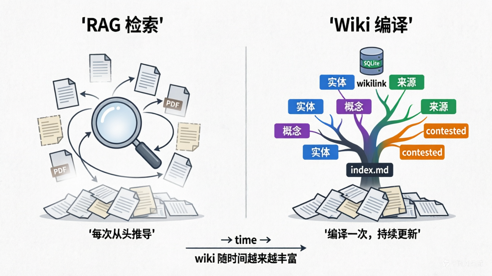
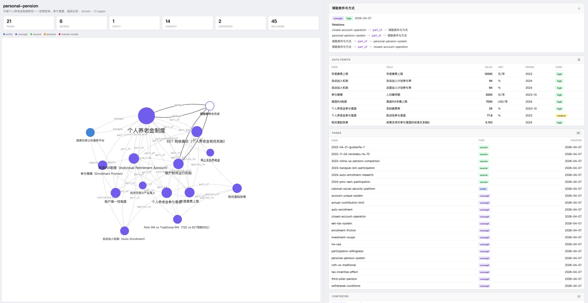
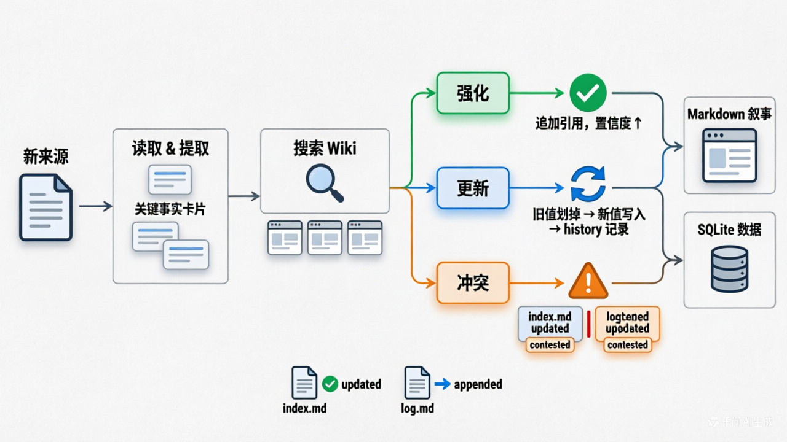
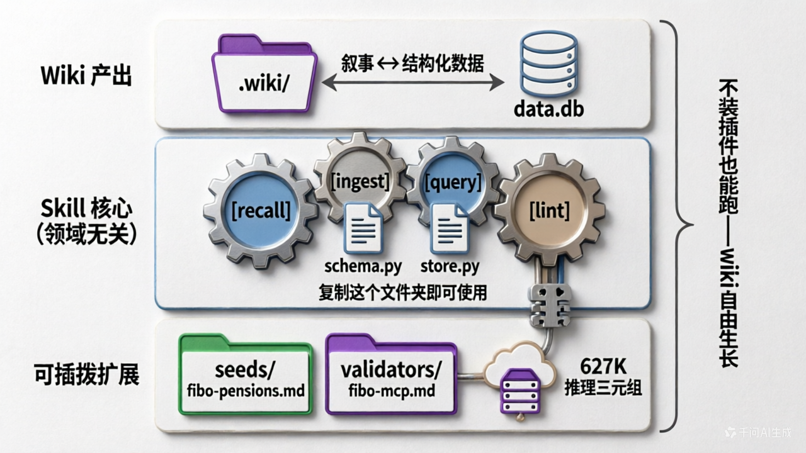
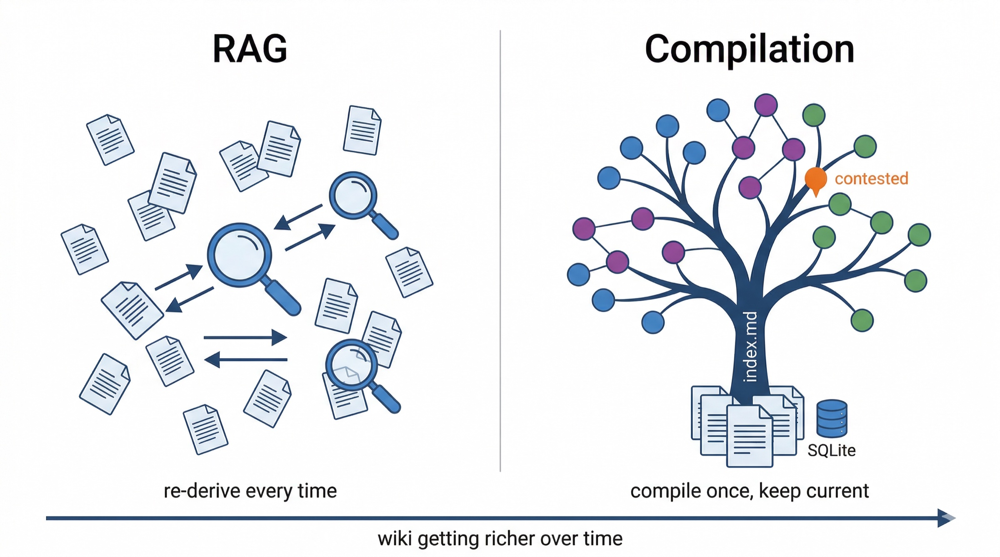
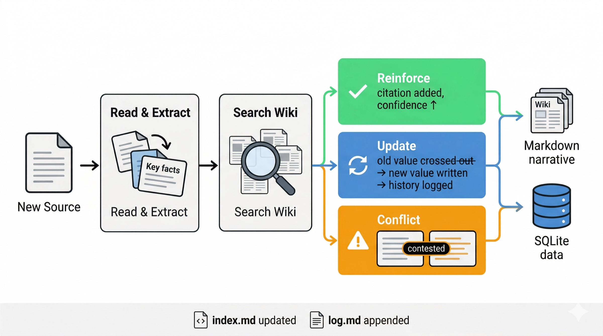
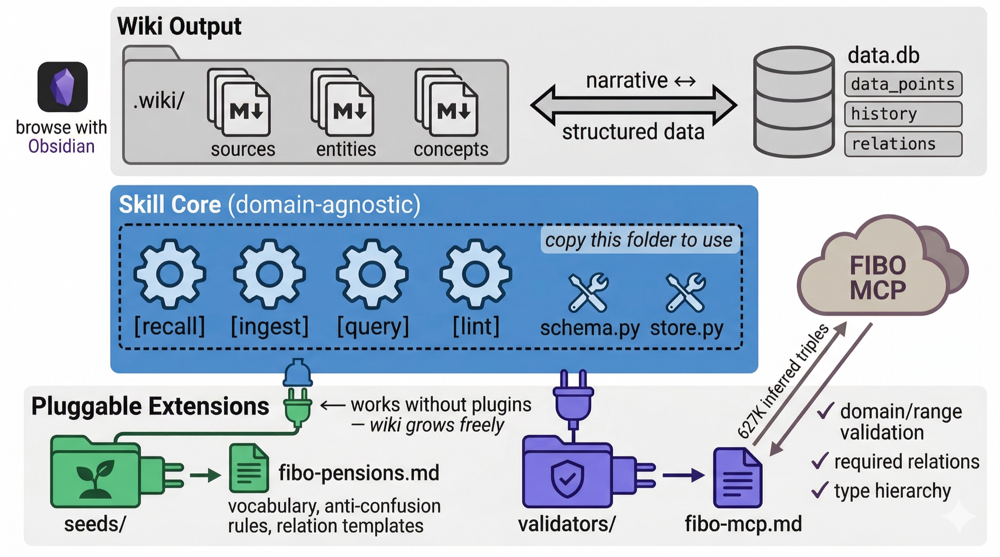

# auto-wiki

> ### Quick Install
>
> ```bash
> git clone https://github.com/hanlinlibham/auto-wiki.git
> cp -r auto-wiki/skill/auto-wiki-cn ~/.claude/skills/auto-wiki
> pip install pyyaml pydantic
> ```
>
> Then, in any empty directory:
>
> ```bash
> mkdir my-knowledge && cd my-knowledge && claude
> ```
> ```
> /auto-wiki init
> ```
>
> **Other agents** — point them at `SKILL.md` and its `references/` directory.
>
> ℹ️ `auto-wiki-cn` is the only maintained edition (**v0.4.4+survey.2**, eight modes). The protocol
> prose is Chinese; the Python tools under `references/` are language-neutral. The English
> edition was **archived at v0.3.0** on 2026-08-12 — it still runs, but has no `init` or
> `source` mode and no precheck gate. See
> [`archive/auto-wiki-en-v0.3.0/`](archive/auto-wiki-en-v0.3.0/). An English port of 0.4.x
> is welcome as a contribution.

> 🏠 **Want the autonomous household *around* this compiler?** [**Burrow**](https://github.com/abuttoncc/Burrow) bundles auto-wiki as its compilation engine and adds the governance layer: a single write gate, an earned-autonomy ledger (agents earn auto-promotion through clean approval streaks), a review queue, and a nightly research flywheel.

<details>
<summary><b>🇨🇳 点击切换中文版</b></summary>

---

> ### 快速安装
>
> ```bash
> git clone https://github.com/hanlinlibham/auto-wiki.git
> cp -r auto-wiki/skill/auto-wiki-cn ~/.claude/skills/auto-wiki
> pip install pyyaml pydantic
> ```
>
> 然后随便找个空目录：
>
> ```bash
> mkdir my-knowledge && cd my-knowledge && claude
> ```
> ```
> /auto-wiki init
> ```
>
> **其他 Agent** — 让它读 `skill/auto-wiki-cn/SKILL.md` 及其 `references/` 目录即可。
>
> ℹ️ 中文版是唯一在维护的版本（**v0.4.4+survey.2**，八模式）。英文版已于 2026-08-12
> **归档在 v0.3.0**，移到 [`archive/auto-wiki-en-v0.3.0/`](archive/auto-wiki-en-v0.3.0/)
> ——仍能跑，但没有 init 和 source 模式，也没有写入前预检。

> 🏠 **想要围绕这个编译器的自治知识工作区？** [**Burrow（陋居）**](https://github.com/abuttoncc/Burrow) 内置 auto-wiki 作为编译引擎，并补上治理层：唯一写入闸门、影子闸账本（agent 靠零驳回连胜挣得自动晋升权）、审核队列、夜间研究飞轮。

教你的 AI Agent 构建和维护持久化知识 wiki——让它不再做完就忘。



### 问题

AI Agent 做研究、写报告、拉数据——然后全忘了。下周问同样领域的问题，又从零开始。RAG 能检索，但不能积累——每次都从原始文档重新推导答案。

### 方案

auto-wiki 是一个给 AI Agent（Claude Code、Codex 等）用的 Skill。装上之后，Agent 会自己维护一个 wiki：读到新材料就和已有页面比对，该更新的更新，说法矛盾的标出来，数据变了的记下演化过程。

八个模式：

| 模式 | 触发 | Agent 做什么 |
|------|------|-------------|
| **survey** | `/auto-wiki survey`、"我已经有笔记了"、"冷启动" | 只读结构扫你已有的笔记目录 → 反推建库提案 → 问出禁混规则 → 出提案与种子草案，**不建库、不写你任何文件** |
| **init** | `/auto-wiki init`、"从零建库" | 访谈你的真实工作流 → 展示提案 → 建领域与本体契约 → 首次 ingest → 用真实问题验收 |
| **source** | `/auto-wiki source`、"按这份清单取材" | 拆索引为原子查询 → 多通道 fan-out 搜原料 → 带溯源整合 → 落 `Inbox/raw/`，**不碰 wiki** |
| **recall** | `/auto-wiki recall {领域}` | 加载 wiki 上下文，后续所有问题先查 wiki 再回答 |
| **ingest** | 提供源材料 | 读源文件 → 比较新旧 → 更新/创建页面 → 数据写入 SQLite |
| **query** | 直接提问 | 单次查询：搜索 wiki → 综合回答并引用来源 → 识别缺口 |
| **lint** | `/auto-wiki lint`、"检查一下" | 扫描全部页面 → 修复断链 → 检测矛盾 → 报告健康度 |
| **deep-dive** | `/auto-wiki deep-dive`、"上强度" | 自动扫描知识缺口 → 用户确认 → 搜索补全 → 编译进 wiki |

Agent 也能从自然语言自动路由——"之前研究过 XX"触发 recall，丢给它一篇文件触发 ingest，说"上强度"触发 deep-dive。

> **source 和 deep-dive 都向外搜，方向相反**：deep-dive 由 lint 找出 wiki **内部**缺口，搜回来直接 ingest；source 由**你给的索引**驱动，向外取材，停在 `Inbox/raw/` 闸前等你过目。source 的产出正是 ingest 的输入。

### 快速开始

**已经有一堆笔记的话，先说 `/auto-wiki survey` 并指给它看**——它只读目录名和文件名（不打开文件），
反推出一份建库提案再问你。有存量的人这样起步，比冷着回答下面三轮准得多。

从零开始的话，在一个空目录里说 `/auto-wiki init`，Agent 会问你三轮：

1. 你拿到一份新材料通常怎么处理、最后要产出什么？以后会反复问这个库的三个问题是什么？
2. 第一份材料是什么？哪些内容需要持续更新？
3. 用不用 Obsidian？材料能不能联网、能不能出本机？

它不会先教你一套本体术语，而是从你的真实工作流反推第一个领域、节点类型和关系。确认提案后自动建库、编译第一份材料、跑结构校验，最后拿你自己提的问题验收。

完成标志不是"目录建出来了"，而是三条：

- `wiki/<领域>/` 里有可追溯的知识；
- `wiki/<领域>/_report.html` 能看到图谱；
- 你那个回归问题，它能引用具体页面和来源回答出来。

没有材料也能先建空库，回归问题会登记为待验收。

**之后的日常：**

```
你：   （把一份研报丢给它）"整理进宏观"
Agent: [读源文件 → 搜 wiki 已有页面 → 比较新旧 → 更新 3 页、新建 1 页、标记 1 处矛盾]

你：   /auto-wiki recall macro
Agent: 已进入 recall 模式。当前 wiki：22 页 / 8 数据点 / 2 处 contested。

你：   "降准空间还有多少？"
Agent: 根据 [[存款准备金率]]、[[流动性缺口]] 和 [[2026-Q2-货币政策执行报告]]...
       ⚠️ 注意：中性利率测算存在矛盾（1.8% vs 2.4%）
       缺口：尚无 2026 年后财政存款季节性数据，建议补充。
```

### 先体验示例

不想拿自己的材料试水，可以先跑内置的阅读库示例——一个已完成首次 ingest 的最小闭环：

```bash
cp -R ~/.claude/skills/auto-wiki/examples/bookshelf /tmp/my-bookshelf && cd /tmp/my-bookshelf
python ~/.claude/skills/auto-wiki/references/store.py init wiki/books
python ~/.claude/skills/auto-wiki/references/schema.py --report wiki/books
```

浏览器打开 `/tmp/my-bookshelf/wiki/books/_report.html`。示例只用于体验，别把示例知识混进自己的正式库。

### 可视化报告



*`schema.py --report` 生成的交互式报告：关系图 + 数据表 + 页面列表 + contested 标注*

查看器全部可选。产物是纯 markdown + SQLite，`_report.html` 是零依赖兜底；Obsidian、IDE、文件管理器都只是适配器，引擎不要求任何一个存在。用 Obsidian 的话，**把整个库目录 Open folder as vault**，不要只打开某个领域子目录。

### Ingest 怎么工作



Agent 拿到新材料后，会逐页和 wiki 里已有的内容比对，然后做出判断：

| 结果 | 触发条件 | 动作 |
|------|---------|------|
| **强化** | 新信息与已有结论一致 | 追加来源引用，提升 confidence |
| **更新** | 新信息有更新的日期或更权威的来源 | 改写页面，旧值进 `facts` 拉链，保留退役历史 |
| **冲突** | 来源意见不一致，无法判断谁对 | 并列保留，标记 `contested` |

写入前还有一道**五试预检**（`precheck.py`）：schema 硬闸 + 四类高频病根（双 yaml 块、枚举夹注、relations 键名、必填缺失）必须修完才落库；同类型撞车检测会提示你该不该合并，但不阻断。

### 存储结构

```
wiki/{领域}/
├── data.db              ← 结构化数据（SQLite：数据点、facts 拉链、事件、关系）
├── meta.yaml            ← 领域元信息
├── _ontology.md         ← 本体契约：节点类型、受控关系词表、六档时间模型、退役协议
├── {领域中文名}.md       ← Hub 页（目录 + 图谱中心）
├── log.md               ← 操作日志（只追加）
├── 机构/ 工具/ 指标/     ← 实体页
├── 机制/                ← 概念-机制页
├── 事件/                ← 事件页
├── 分析/                ← 分析页（研究课题落这里，不再各自开库）
└── 来源/                ← 来源摘要页
```

**两层，职责清晰：**

- **Markdown 页面**——叙述性分析、wikilink、人可读。中文 slug = 文件名 = wikilink = data.db 主键。
- **SQLite**——数值、时间序列、关系、历史。数值绝不做节点，一律进 data.db；分类标签是边不是页。

wiki 按**领域**组织，不按研究课题。"美联储加息周期"这类课题降级为 `{领域}/分析/` 下一页，实体和概念跨课题共享。

### 垂直领域适配



Skill 核心是领域无关的编译引擎。垂直领域的专业性通过可插拔的种子和校验器注入：

- **无种子**：wiki 自由生长，适合探索性研究
- **有种子**（`seeds/`）：Agent 从行业标准术语起步，遵守禁混规则，概念命名规范
- **有校验器**（`validators/`）：lint 检查逻辑完整性——不是纠错别字，是纠"PensionFund 缺少 Trustee 关系"

当前自带 `reading-notes`（读书/课程/论文/播客通用冷启动）和 `fibo-pensions`（企业年金，基于 FIBO 标准）两个种子。种子是社区可贡献的插件——为你的垂直领域写一个 markdown 文件，声明核心术语和禁混规则即可。

### 对外交换

```bash
python references/export_okf.py wiki/{领域}
```

把一个领域投影成 [OKF v0.1](https://github.com/GoogleCloudPlatform/knowledge-catalog) bundle（厂商中立的最小知识交换格式），给非 Obsidian 工具或想用 git 交换知识时用。**这是单向投影**——OKF 装不下双时态层和类型边，导出会压平这两样，所以绝不反向拿 OKF 当主存。

### 语言版本

| 版本 | 目录 | 状态 |
|------|------|------|
| 中文 | `skill/auto-wiki-cn/` | **v0.4.4+survey.2** — 在维护。八模式（本版新增 survey 存量勘察；0.4.x 引入 init 访谈建库、source 取材）、五试预检、实例配置解耦、可运行示例 |
| English | [`archive/auto-wiki-en-v0.3.0/`](archive/auto-wiki-en-v0.3.0/) | **v0.3.0 · 已归档（2026-08-12）** — 五模式，仍能跑但不再更新 |

复制一个目录就能独立工作。英文版归档的原因和缺失清单见
[`archive/README.md`](archive/README.md)——退役不删除，文件原样保留。

`references/` 下的 Python 工具与语言无关。读英文但想要最新能力的话，直接取中文版：
代码是同一套，只有协议散文是中文。英文版 0.4.x 的移植欢迎以贡献形式提交。

### 致谢

- **[LLM Wiki](https://github.com/swyxio/ai-notes/blob/main/Resources/llmwiki.md)** — 想法由 [Tobi Lutke](https://x.com/tobi/status/1935967165527437666) 提出，[swyx](https://github.com/swyxio) 整理为实现文档
- **[autoresearch](https://github.com/karpathy/autoresearch)** by Andrej Karpathy
- **[FIBO](https://spec.edmcouncil.org/fibo/)** by EDM Council · **[fibo-mcp](https://github.com/NeurofusionAI/fibo-mcp)** by NeurofusionAI
- **[Nuwa Skill](https://github.com/alchaincyf/nuwa-skill)** by 花叔 · **[Obsidian](https://obsidian.md/)**

MIT. 见 [LICENSE](LICENSE)。

---

</details>

Teach your AI agent to build and maintain a persistent knowledge wiki — so it stops forgetting what it learned yesterday.



## The Problem

AI agents do research, write reports, pull data — then forget everything. Ask the same domain question next week, and the agent starts from scratch. RAG helps with retrieval, but it doesn't *accumulate* — it re-derives answers from raw documents every time.

## The Solution

auto-wiki is a **knowledge compiler** skill for AI agents (Claude Code, Codex, etc.). Instead of retrieving from raw documents at query time, the agent incrementally builds and maintains a structured wiki — comparing new information against existing pages, updating what changed, flagging contradictions, and preserving the evolution of knowledge.

Eight modes:

| Mode | Trigger | What the Agent Does |
|------|---------|-------------------|
| **survey** | `/auto-wiki survey`, "I already have notes" | Scan an existing notes folder **structure-only** → reverse-infer the setup proposal → elicit anti-confusion rules → emit proposal and seed drafts, **creating nothing and writing none of your files** |
| **init** | `/auto-wiki init`, "start from scratch" | Interview your actual workflow → propose → create domain + ontology contract → first ingest → verify with a real question |
| **source** | `/auto-wiki source`, "collect material for this list" | Split index into atomic queries → fan-out across channels → integrate with provenance → land in `Inbox/raw/`, **never touching the wiki** |
| **recall** | `/auto-wiki recall {domain}` | Load wiki context, answer all subsequent questions from accumulated knowledge |
| **ingest** | Provide source material | Read source → compare old vs new → update/create pages → write data to SQLite |
| **query** | Just ask | One-shot: search wiki → synthesize answer with citations → identify gaps |
| **lint** | `/auto-wiki lint` | Scan all pages → fix broken links → detect contradictions → report health |
| **deep-dive** | `/auto-wiki deep-dive`, "level up" | Auto-scan knowledge gaps → user confirms → search to fill → compile into wiki |

The agent also auto-routes from natural language — "what did we learn about X" triggers recall, handing it a file triggers ingest, saying "level up" triggers deep-dive.

> **source and deep-dive both search outward, in opposite directions**: deep-dive lets lint find gaps *inside* the wiki and ingests what it finds; source is driven by *an index you supply*, collects outward, and stops at the `Inbox/raw/` gate for your review. source output is ingest input.

## Quick Start

After installing, run `/auto-wiki init` in an empty directory. The agent asks three rounds:

1. What do you normally do with a new piece of material, and what do you produce? What three questions will you ask this knowledge base over and over?
2. What's the first piece of material? What needs to stay continuously updated?
3. Obsidian or not? Can the material go online, or leave this machine?

It doesn't make you learn ontology jargon first — it infers your first domain, node types and relations from your actual workflow. After you confirm the proposal it creates the domain, compiles your first source, runs structural validation, and verifies with the question you supplied.

Done means three things, not "the directory exists":

- `wiki/<domain>/` holds traceable knowledge;
- `wiki/<domain>/_report.html` renders the graph;
- your regression question gets answered with page and source citations.

**Then, day to day:**

```
You:   (hand it a research report) "file this under macro"
Agent: [reads source → searches existing pages → compares → updates 3 pages, creates 1, flags 1 contradiction]

You:   /auto-wiki recall macro
Agent: Recall mode active. Wiki: 22 pages / 8 data points / 2 contested.

You:   "How should policy be designed to increase participation?"
Agent: Based on [[enrollment-friction]], [[tax-incentive-effect]], and [[ira-usa]]...
       ⚠️ Note: tax incentive effectiveness is contested (77.8% vs 25%)
       Gap: no research on under-35 demographics yet — suggest ingesting more.
```

## Try the Example First

Don't want to risk your own material? Run the bundled bookshelf example — a minimal closed loop that has already been ingested once:

```bash
cp -R ~/.claude/skills/auto-wiki/examples/bookshelf /tmp/my-bookshelf && cd /tmp/my-bookshelf
python ~/.claude/skills/auto-wiki/references/store.py init wiki/books
python ~/.claude/skills/auto-wiki/references/schema.py --report wiki/books
```

Open `/tmp/my-bookshelf/wiki/books/_report.html`. It's for tasting only — don't mix example knowledge into a real wiki.

## Architecture

```
wiki/{domain}/
├── data.db              ← Structured data (SQLite: data points, bitemporal facts, events, relations)
├── meta.yaml            ← Domain metadata
├── _ontology.md         ← Contract: node types, controlled relation vocabulary, six-tier time model, retirement protocol
├── {domain}.md          ← Hub page (navigation + graph center)
├── log.md               ← Operation log (append-only)
├── institutions/ instruments/ indicators/   ← Entity pages
├── mechanisms/          ← Concept/mechanism pages
├── events/              ← Event pages
├── analyses/            ← Analysis pages (research topics live here, not in their own wikis)
└── sources/             ← Source summaries
```

**Two layers, clean separation:**

- **Markdown pages** — narrative analysis, wikilinks, human-readable. Slug = filename = wikilink = data.db primary key. Compatible with [Obsidian](https://obsidian.md/).
- **SQLite database** — numeric data, time series, relations, history. Numbers are never nodes; classification labels are edges, not pages.

Wikis are organized **by domain, not by research topic**. A topic like "the Fed hiking cycle" demotes to one page under `{domain}/analyses/`, so entities and concepts are shared across topics.

## How Ingest Works



When the agent gets a new source, it compares against every relevant wiki page and decides:

| Result | When | Action |
|--------|------|--------|
| **Reinforce** | New info matches existing conclusion | Add source citation, raise confidence |
| **Update** | New info has newer date or better source | Rewrite page, old value enters the `facts` zipper, retirement history preserved |
| **Conflict** | Sources disagree, can't determine which is right | Keep both, mark as `contested` |

Before anything lands there's a **five-check precheck** (`precheck.py`): a schema hard gate plus four high-frequency defect classes (double YAML blocks, enum inline comments, relation key names, missing required fields) must be clean to commit. Same-type collision detection advises on merges without blocking.

## How Recall Works

Recall is a persistent mode for the conversation. Once entered, every question consults the wiki first:

1. Agent loads the hub page + `data.db` summary on entry
2. For each question: extract keywords → match pages in the hub → query data.db → read relevant pages
3. Answer with citations (`[[page-slug]]`), flag contested info, report knowledge gaps
4. Never fabricate — if the wiki doesn't have it, say so, log a query-miss, and suggest what to ingest

Exit with `exit recall` or by switching to another mode.

## Vertical Domain Adaptation



The skill core is a domain-agnostic compilation engine. Vertical domain expertise is injected through pluggable seeds and validators:

- **Without a seed**: wiki grows freely, suitable for exploratory research
- **With a seed** (`seeds/`): agent starts from industry standard terms, follows anti-confusion rules, normalized naming
- **With a validator** (`validators/`): lint checks logical completeness — not typos, but "PensionFund is missing a Trustee relation"

Ships with `reading-notes` (books, courses, papers, podcasts) and `fibo-pensions` (occupational pensions, FIBO-based). Seeds are community-contributable plugins — write a markdown file for your vertical domain declaring core terms and anti-confusion rules.

## Visualization


*Interactive report generated by `schema.py --report`: relation graph + data points + pages + contested markers*

```bash
python references/schema.py --report wiki/my-domain/
# → generates wiki/my-domain/_report.html
# → open in browser
```

Viewers are all optional. Output is plain markdown + SQLite; `_report.html` is the zero-dependency fallback. With Obsidian, **open the whole vault directory** — not an individual domain subfolder.

## Export

```bash
python references/export_okf.py wiki/{domain}
```

Projects a domain into an [OKF v0.1](https://github.com/GoogleCloudPlatform/knowledge-catalog) bundle — a vendor-neutral minimal knowledge interchange format — for non-Obsidian consumers or git-based exchange. **This is a one-way projection**: OKF has no room for the bitemporal layer or typed edges, so both get flattened. Never use OKF as primary storage.

## Tools

| Tool | Purpose | Usage |
|------|---------|-------|
| `schema.py` | Validate page frontmatter | `python schema.py wiki/domain/` |
| `schema.py --report` | Generate visual HTML report | `python schema.py --report wiki/domain/` |
| `precheck.py page` | Pre-write hard gate (schema + 4 defect classes) | `python precheck.py page wiki/domain/page.md` |
| `precheck.py dup` | Same-type collision detection | `python precheck.py dup "candidate" --wiki wiki/domain` |
| `store.py init` | Initialize data.db | `python store.py init wiki/domain/` |
| `store.py dump` | Print database summary | `python store.py dump wiki/domain/` |
| `new_domain.py` | Scaffold a new domain | `python new_domain.py macro --seed reading-notes` |
| `export_okf.py` | Export an OKF bundle | `python export_okf.py wiki/domain/` |

## Requirements

- Python 3.8+ (standard library `sqlite3` — no external DB needed)
- `pyyaml` and `pydantic` for schema validation (`pip install -r requirements.txt`)
- An AI agent that can read/write files (Claude Code, Codex, etc.)
- Optional: WebSearch capability for autonomous research and `source` mode

The passive path — you supply files, the agent compiles them — needs only Python 3 and file I/O. Every network call is an optional enhancement.

## Acknowledgements

This project builds on ideas and inspiration from:

- **[LLM Wiki](https://github.com/swyxio/ai-notes/blob/main/Resources/llmwiki.md)** — the pattern of LLM-maintained persistent wikis. The idea was [proposed by Tobi Lutke](https://x.com/tobi/status/1935967165527437666) and formalized into the implementation document by [swyx](https://github.com/swyxio). auto-wiki's compilation model grew out of this.

- **[autoresearch](https://github.com/karpathy/autoresearch)** by Andrej Karpathy — showed that agents can run their own research loops. autoresearch optimizes training metrics; auto-wiki borrows the same "agent as researcher" idea for knowledge accumulation.

- **[FIBO](https://spec.edmcouncil.org/fibo/)** by EDM Council — the most widely adopted semantic ontology for finance (627K+ inferred triples). auto-wiki's seed/validator system was built to plug into standards like FIBO for logical validation.

- **[fibo-mcp](https://github.com/NeurofusionAI/fibo-mcp)** by NeurofusionAI — the MCP server that materializes FIBO into a queryable SPARQL endpoint. auto-wiki's validator example (`validators/fibo-mcp.md`) is built on top of this project.

- **[Nuwa Skill](https://github.com/alchaincyf/nuwa-skill)** by 花叔 — a cognitive profiling methodology for extracting mental models, heuristics, and decision patterns from a person's writings and decisions. auto-wiki's cognitive ontology type (`ontology-types/cognitive.md`) was adapted from this approach.

- **[Obsidian](https://obsidian.md/)** — wiki format (YAML frontmatter + `[[wikilinks]]`) is Obsidian-compatible by design. The agent compiles in the background; you browse with Obsidian.

## Language Versions

| Version | Directory | Status |
|---------|-----------|--------|
| Chinese | `skill/auto-wiki-cn/` | **v0.4.4+survey.2** — maintained. Eight modes (this edition adds `survey` structure-only recon of existing notes; 0.4.x added `init` and `source`), five-check precheck, decoupled instance config, runnable example |
| English | [`archive/auto-wiki-en-v0.3.0/`](archive/auto-wiki-en-v0.3.0/) | **v0.3.0 · archived 2026-08-12** — five modes, still runs, no longer updated |

Copy one directory and it works standalone. The English edition was archived rather than
deleted — every file is kept exactly as it was; see [`archive/README.md`](archive/README.md)
for the reason and the full list of what it lacks.

The Python tools under `references/` are language-neutral. If you read English but want the
current feature set, take the Chinese edition — the code is identical, only the protocol
prose is in Chinese. An English port of 0.4.x is welcome as a contribution; open an issue
first so the work isn't duplicated.

## License

MIT. See [LICENSE](LICENSE).
